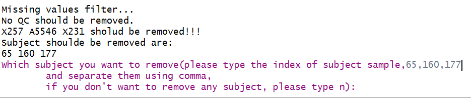
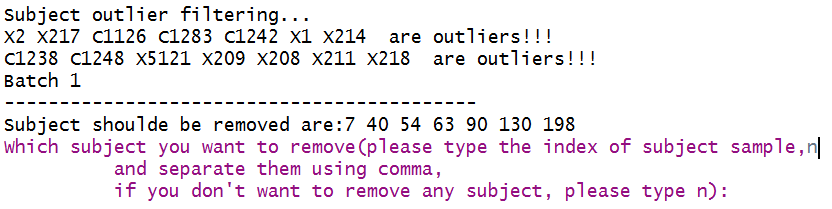
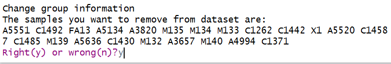

## **Introduction**
******************************************
### *MetCleaning* provides an integrated and automatic pipeline for data cleaning and statistical analysis of large scale mass spectrometry (MS) based-metabolomic data. It includes missing value (MV) filtering and imputation, zero value filtering, data normalization, data integration, data quality assessment, univariate statistical analysis, multivariate statistical analysis such as PCA and PLS-DA, potential marker selection and show. This document describes how to use the integrated functions, *MetClean* and *MetStat* in *MetCleaning* utilizing demo data.


## **Installation and help**
******************************************
### *MetCleaning* is published in github [(link)](https://github.com/jaspershen/MetCleaning). So you can install it via to github.

####code 1: Installation of *MetCleaning*
```{r, eval= FALSE}
##pcaMethods and impute should be installed form bioconductor
##pcaMethos
source("http://bioconductor.org/biocLite.R")
    biocLite("pcaMethods")
##impute
source("http://bioconductor.org/biocLite.R")
    biocLite("impute")
 if(!require(devtools)) {
  install.packages("devtools")
 }
 library(devtools)
 install_github("jaspershen/MetCleaning")
 library(MetCleaning)
 help(package = "MetCleaning")
```

## **Data cleaning**
******************************************
### Data cleaning is integrated as a function named as *MetClean* in *MetCleaning*. We use the demo data as the example. Copy the code below and paste in you R console.

####code 2: Demo data of *MetClean*
```{r, eval = FALSE}
##demo data
data(data, package = "MetCleaning")
data(sample.information, package = "MetCleaning")
##demo work directory
dir.create("Demo for MetCleaning")
setwd("Demo for MetCleaning")
##write files
write.csv(data, "data.csv", row.names = FALSE)
write.csv(sample.information , "sample.information.csv", row.names = FALSE)
```

### The demo data have been added in your work directory and organized in you work directory as Figure 2 shows. It contains two files, "data.csv" and "sample.information.csv".
### 1. "data.csv" is the metabolomic dataset you want to process. Rows are features and columns are feature abundance of samples and information of features. The information of features must contain "name" (feature name), "mz" (mass to change ratio) and "rt" (retention time). Other information of features are optional, for example "isotopes" and "adducts". The name of sample can contain ".", but cannot contain "-" and space. And the start of sample name cannot be number. **For example, "A210.a" and "A210a" are valid, and "210a" or "210-a" are invalid.**
### 2. "sample.information.csv" is sample information for metabolomic dataset. Column 1 is "sample.name" which is the names of subject and QC samples. Please confirm that the sample names in "sample.information.csv" and "data.csv" are completely same. Column 2 is "injection.order" which is the injection order of QC and subject samples. Column 3 is "class", which is used to distinguish "QC" and "Subject" samples. Column 4 is "batch" to provide acquisition batch information for samples. Column 5 is "group", which is used to label the group of subject sample, for example, "control" and "case". The "group" of QC samples is labeled as "QC".


### Then you can run *MetClean* function to do data cleaning of data. All the arguments of *MetClean* can be found in the other functions in *MetCleaning*. You can use *help(package = "MetCleaning")* to see the help page of *MetCleaning*. 

####code 3: Running of *MetClean*
```{r, eval = FALSE}
##demo data
MetClean(polarity = "positive")
```

###Running results of *MetClean*
#### 1.Missing or zero values filtering. In the missing or zero value filtering step, if there are samples which beyond the threshold you set, you should decide to filter them or not. We recommend to remove all of them as Figure 3 shows.



#### 2.Sample filtering. In the QC or subject sample filtering step (based on PCA), if there are samples which beyond the threshold you set, you should decide to filter them or not. We don't recommend to remove them as Figure 4 shows, because they should be consired combined other information.



#### 3.Output files. Output files of *MetClean* are listed as Figure 5 shows.
##### (1) "1MV overview", "2MV filter", "3Zero overview" and "4Zero filter" are missing and zero values filtering information.
##### (2) "5QC outlier filter" and "6Subject outlier filter" are sample filtering based on PCA information.
##### (3) "7Normalization result" is the data normalization information for each batch.
##### (4) "8Batch effect" is the batch effect both in before and after data cleaning.
##### (5) "9metabolite plot" is the scatter plot for each feature.
##### (6) "10Data overview" is the overview of data.
##### (7) "11RSD overview" is the RSD distribution for each batch both before and after data cleaning.
##### (8) **"data_after_pre.csv", "qc.info.csv" and "subject.info"** are the data and sample information after data cleaning.
##### (9) "intermediate" is the intermediate data during processing.


## **Statistical analysis**
******************************************
### Data statistical analysis is integrated as a function named as *MetStat* in *MetCleaning*. We use the demo data as the example. **Please note that now *MetStat* can only process two class data.** Copy the code below and paste in you R console.

####code 4: Demo data of *MetStat*
```{r, eval = FALSE}
data("met.data.after.pre", package = "MetCleaning")
data(new.group, package = "MetCleaning")
##create a folder for MetStat demo
dir.create("Demo for MetStat")
setwd("Demo for MetStat")
## export the demo data as csv
write.csv(new.group, "new.group.csv", row.names = FALSE)
```

### The demo data have been added in your work directory. "new.group.csv" is a sample.information which has been changed the group information you want to use for statistical analysis. For the sample which you don't want to use them for statistical analysis, you can set they group information as NA like Figure 6 shows.


####code 5: Running of *MetStat*
```{r, eval = FALSE}
MetStat(MetFlowData = met.data.after.pre, new.group = TRUE)
```

###Running results of *MetStat*
#### 1.Sample removing. Firstly, you need to confirm the samples which you want to remove form dataset as Figure 7 shows.



#### 2.Number of component selection in PLS-DA analysis. In PLS-DA analysis, you should manually select the best choice of the number of component. When the Console show "How many comps do you want to see?", you can type 10 and enter "Enter" key. Then a MSE plot is showing, and the best number of component is the one has the smallest CV values. So type the number (in this example is 4) and enter "Enter" key.


#### 3.Output files. Output files of *MetStat* are listed as Figure 9 shows.
##### (1) "12PCA analysis" is the PCA score plot.
##### (2) "13PLS analysis" contains the PLS-DA results.
##### (3) "14heatmap" is the heatmap.
##### (4) "15marker selection" contains the information of markers, volcano plot and boxplots of markers.
##### (5) **"data_after_stat.csv", "qc.info.csv" and "subject.info"** are the data and sample information after statistical analysis.
##### (6) "intermediate" is the intermediate data during processing.


